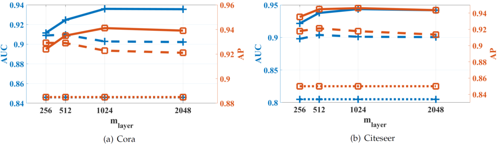

# Graph RCF-GAN
This repo implements the RCF-GAN to learn representations of node signals, and consequently predict graph links. The detailed introduction of the RCF-GAN can be found at here https://github.com/ShengxiLi/rcf_gan.



## How To Install
Follow the steps in the original RCF-GAN repo: https://github.com/ShengxiLi/rcf_gan

## How To Use
```Python main.py```

## Special Thanks
* Pytorch implementation of graph convolution layers at: https://github.com/tkipf/pygcn/
* Pre-processing utils from the TensorFlow graph VAE repo: https://github.com/tkipf/gae/

